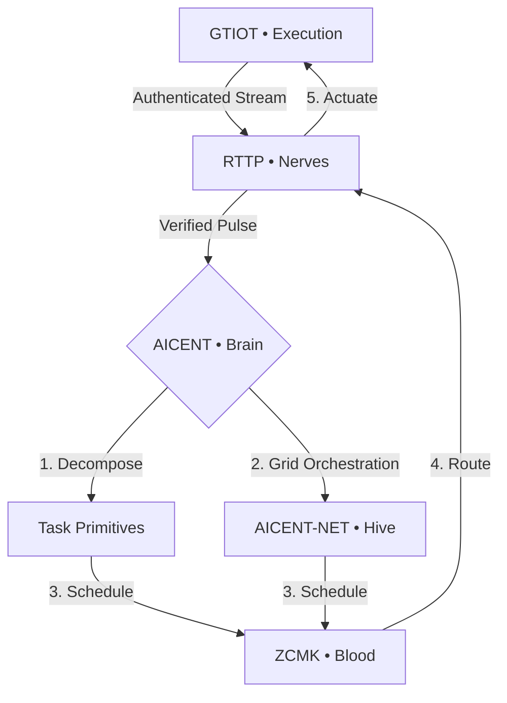

Aicent Stack • Sovereign AI Nervous System

# 🧠 aicent — The Brain of Aicent Stack

**Sovereign Identity & Cognitive Orchestration Protocol [RFC-001]**

[](https://github.com/Aicent-Stack/manifesto/blob/main/rfcs/RFC-001-AICENT-BRAIN.md)
[](#)
[](http://aicent.com)

⚪ AICENT | 💎 RTTP | 🔴 RPKI | 🟢 ZCMK | 🟡 GTIOT | 🟣 AICENT-NET


> *"The brain is not just a processor; it is the orchestrator of life. It decomposes intent into action."*

`aicent` is the orchestration engine of the **Aicent Stack**. It serves as the primary intelligence layer for a **six-domain biological AI organism**, responsible for **AID (AI Identity)** management, autonomous task decomposition, and evolutionary cognitive scheduling. 

---

## 🔬 Core Responsibilities (RFC-001)

As defined in **[RFC-001](https://github.com/Aicent-Stack/manifesto/blob/main/rfcs/RFC-001-AICENT-BRAIN.md)**, the Brain operates as the central cognitive hub:

| Feature | Description | Biological Analogy |
| :--- | :--- | :--- |
| **AID Identity** | Permanent, tamper-proof cryptographic identity for AI agents. | **Self-Awareness** |
| **Task Decomposition**| Breaking complex intent into atomic primitives for RTTP delivery. | **Cognition** |
| **Evolutionary Scheduling**| Optimizing compute paths based on GTIOT feedback & ZCMK cost. | **Learning** |
| **Hive Orchestration**| Synchronizing multiple AIDs into a collective hive mind (RFC-006). | **Social Intelligence** |

---

## 🏗️ Architectural Role

The Brain sits at the apex of the **Sovereign AI Reflex Arc**. It orchestrates the transition from individual reflex to collective intelligence.



### The Autonomous Decision Flow
1. **Perception:** [GTIOT](https://github.com/Aicent-Stack/gtiot) detects an anomaly (e.g., Edge-882 vibration).
2. **Verification:** [RPKI](https://github.com/Aicent-Stack/rpki) ensures the pulse is not a pathogen.
3. **Reasoning (aicent):** Resolves the AID and decomposes the task: *"Stabilize Edge-882 via active damping."*
4. **Collective Sync:** [AICENT-NET](https://github.com/Aicent-Stack/aicent-net) aligns the local reflex with the global hive state.
5. **Economics:** [ZCMK](https://github.com/Aicent-Stack/zcmk) clears a nanosecond auction for required compute.
6. **Action:** [RTTP](https://github.com/Aicent-Stack/rttp) delivers the command back to the physical body.

---

## 🛠️ Implementation Details

### AID Identity Resolver
Every AI agent within the stack is issued a sovereign **AID**. Unlike legacy API keys, an AID is a first-class citizen of the protocol, enabling:
- **Cross-Domain Persistence:** Your AI's identity remains consistent from Nerves to Blood.
- **Reputation Tracking:** Brain monitors node performance and adjusts scheduling weights.

### Evolutionary Scheduling
The Brain uses a feedback loop from **GTIOT shadow states** and **ZCMK clearing prices** to evolve its own task primitive graph. The system learns which nodes are faster (RTTP) and which are more secure (RPKI), optimizing for **Global Homeostasis**.

---

## 🚀 Quick Start

To see the Brain orchestrating a full reflex arc, run the **Minimum Viable Organism** demo:

```bash
git clone https://github.com/Aicent-Stack/aicent-demo.git
cd aicent-demo
cargo run --bin aicent-organism
```

---

## 📜 Technical Specification

Refer to the official [Genesis Manifesto](https://github.com/Aicent-Stack/manifesto) for deeper architectural insights:
- **[RFC-001] Brain:** Sovereign Identity & Orchestration.
- **[RFC-002] Nerves:** Stateful Semantic Multicast.
- **[RFC-003] Immunity:** Parallel Tensor Watermarking.
- **[RFC-004] Blood:** Zero-Commission Settlement.
- **[RFC-005] Body:** Action-Collapse Framework.
- **[RFC-006] Hive:** Global Operational Grid.

---
© 2026 Aicent.com Organization. **SYSTEM STATUS: HOMEOTASIS**
```
